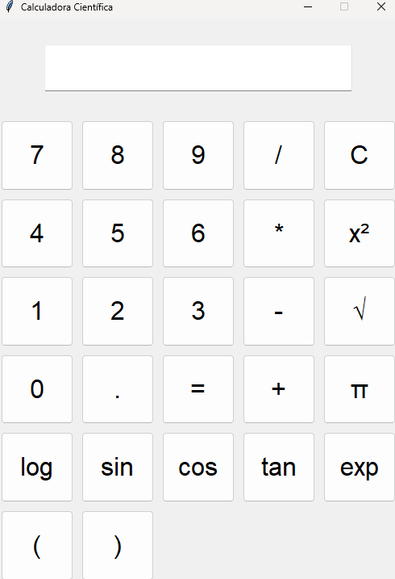

# Calculadora Científica en Python 🧮

## Descripción

Esta es una **calculadora científica** desarrollada en Python utilizando la biblioteca **tkinter** para la interfaz gráfica de usuario. La calculadora soporta operaciones básicas y avanzadas, incluyendo funciones matemáticas como seno, coseno, tangente, logaritmos, potencias y raíces cuadradas.

## Capturas de Pantalla

## Requisitos

- **Python 3.12.4**
- **tkinter:** Generalmente incluido con Python.

### Clonar el Repositorio
    git clone https://github.com/moises60/calculadora_python.git

### Acceder a la Carpeta
    cd calculadora_python
    
### Ejecutar el Juego
    python3 main.py